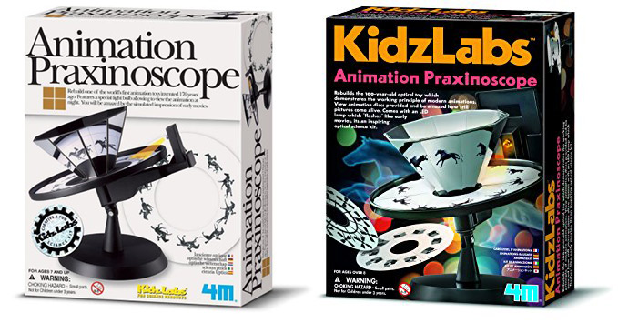
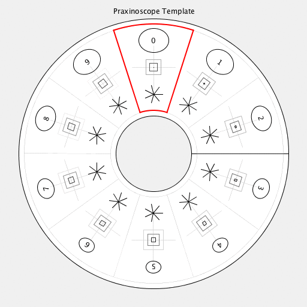
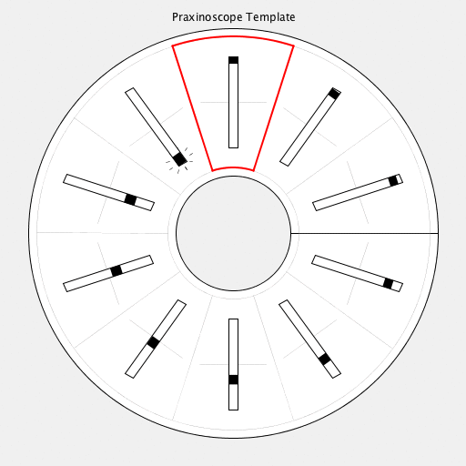

# PraxinoscopeTemplate
Processing Template for KidzLabs/4M/Toysmith Animation Praxinoscope  
Developed for Processing 3.3.6 / 23 January 2018 by Golan Levin 

* Animation Praxinoscopes are available from: 
* https://www.amazon.com/4M-3474-Animation-Praxinoscope/dp/B000P02HYC
* https://www.walmart.com/ip/Animation-Praxinoscope-Science-Kits-by-Toysmith-3474/45681503

It is anticipated that students will customize the code in the "drawArtFrame()" function in PraxinoscopeTemplate.pde with their own design. No other code needs to be modified. Pressing 'p' exports a PDF. Cut out the circle and put it on your spinny praxinoscope. Fun!

Also see this template for a Zoetrope: https://github.com/golanlevin/ZoetropeTemplate

